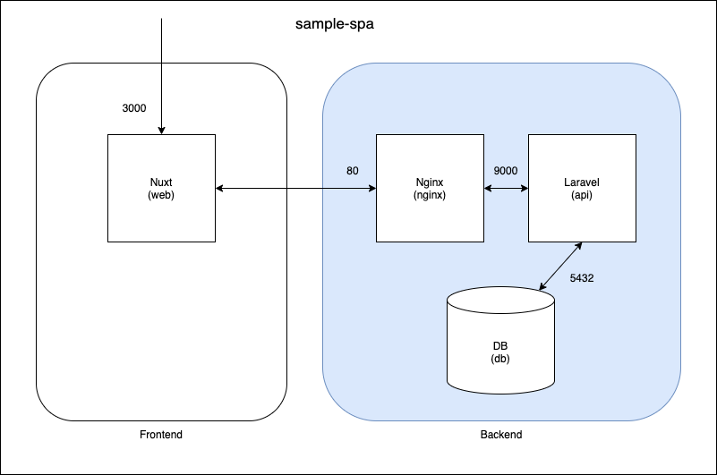

## 概要
[sample-spa-nuxt](https://github.com/nagi125/sample-spa-nuxt)のBackend
SPAの確認をするための最低限の実装にしてあります。

## ミドルウェアのバージョン
- PHP:8.0.x
- Laravel:8.x
- PostgreSQL:12.x

## 構成図


## 初期セットアップ
※ APP_KEYの値が変更されるので実行は初回だけにしてください
```
$ docker-compose build
$ docker-compose up -d
$ docker-compose exec app composer install

$ cp .env.example .env
$ docker-compose exec app php artisan key:generate
$ docker-compose exec app php artisan migrate:refresh --seed
```

## 各種コマンド
### 環境立ち上げ
```
$ docker-compose up
```

### 環境停止
```
$ docker-compose down
```
